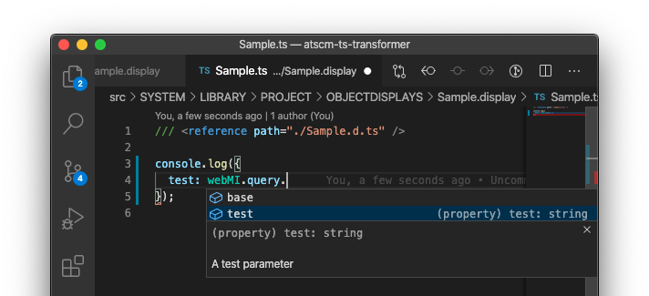

# atscm/ts-demo

> An atscm demo project that uses TypeScript source files.
>
> **Note that this is work in process**

## How it works

In order to get atscm to transpile TypeScript files, we need to do the following:

- Patch Display- and Script-Transformers (See [Atviseproject.js](./Atviseproject.js))
- Add a transformer that compiles TypeScript to JavaScript (See [atscm/TypeScriptTransformer.js](./atscm/TypeScriptTransformer.js))

## Advantages

- Users can write type-safe JavaScript
- IDEs can provide better autocompletion

  - If you provide type definitions for display parameters (like [the ones in the Sample display](./src/SYSTEM/LIBRARY/PROJECT/OBJECTDISPLAYS/Sample.display/Sample.d.ts)) your IDE autocompletes them:

    

## Limitations

- Currently mixed JS and TS code is not supported, so all
- Currently does not handle TypeScript in Resource-files (e.g. `SYSTEM.LIBRARY.PROJECT.RESOURCES/test.ts` is pushed as-is)
